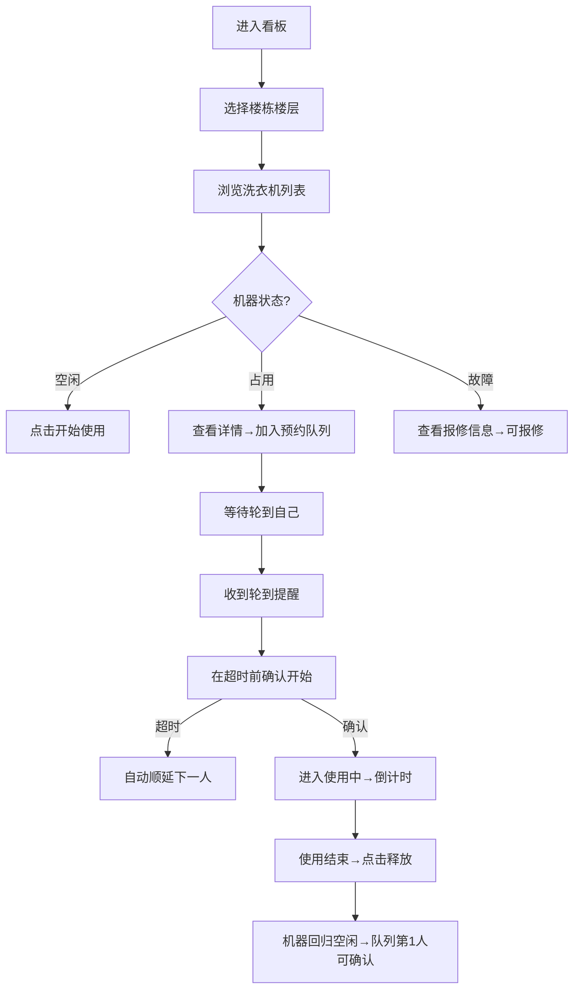
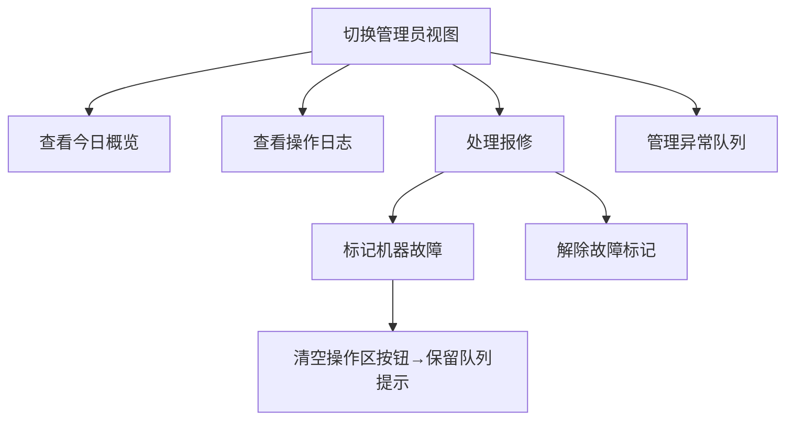

## 1. 产品概述

自助洗衣机占用看板是一款面向宿舍社区的洗衣机使用管理前端应用，解决住户排队无序、预约冲突、机器状态不透明等痛点。
- 目标用户：宿舍住户（使用者）和宿舍管理员（维护者）
- 核心价值：提升洗衣机使用效率，减少无效等待，规范报修流程

## 2. 核心功能

### 2.1 用户角色

| 角色 | 登录方式 | 核心权限 |
|------|----------|----------|
| 住户 | 本地模拟选择用户 | 查看机器状态、预约/排队、开始/结束使用、设置提醒、查看日志 |
| 宿舍管理员 | 本地模拟切换角色 | 所有住户权限 + 标记故障、管理预约队列、查看今日概览、管理报修 |

### 2.2 功能模块

1. **主看板页**：楼栋楼层筛选、洗衣机状态列表、机器详情弹窗
2. **预约排队模块**：加入预约、取消预约、排队顺序展示、超时顺延
3. **使用管理模块**：开始使用、结束释放、剩余时间倒计时
4. **故障报修模块**：住户报修、管理员标记/解除故障
5. **提醒设置模块**：机器空闲提醒、轮到使用提醒、自定义提前提醒时长
6. **管理员视图**：今日概览统计、队列管理、报修记录、操作日志

### 2.3 页面详情

| 页面名称 | 模块名称 | 功能描述 |
|-----------|-------------|---------------------|
| 主看板页 | 楼栋楼层筛选 | 下拉选择楼栋、楼层，过滤显示对应洗衣机 |
| 主看板页 | 洗衣机列表卡片 | 显示机器编号、状态颜色（空闲/占用/故障）、剩余时间、当前使用人、队列长度 |
| 主看板页 | 机器详情弹窗 | 完整信息：状态条、占用人详情、完整预约队列、操作按钮区 |
| 主看板页 | 角色切换栏 | 顶部切换当前登录住户/管理员身份，支持用户选择 |
| 机器详情 | 预约排队区 | 显示队列顺序、加入排队按钮、取消预约按钮、超时倒计时 |
| 机器详情 | 使用操作区 | 开始使用（第一人确认）、结束释放、延长使用（可选） |
| 机器详情 | 故障报修区 | 住户填写报修说明、管理员标记故障/解除故障 |
| 提醒设置 | 全局提醒面板 | 空闲提醒开关、轮到提醒开关、提前分钟数、保存到本地 |
| 管理员视图 | 今日概览 | 使用次数统计、故障数、平均等待时长、各楼层使用率热力 |
| 管理员视图 | 操作日志 | 所有本地操作记录：时间、操作人、动作、机器、结果 |
| 管理员视图 | 报修记录 | 故障机器列表、报修时间、处理状态、报修说明 |

## 3. 核心流程

### 主使用流程（住户）

### 管理员流程

## 4. 用户界面设计

### 4.1 设计风格

- **主色**：深水鸭绿 `#0d9488`（科技感、清洁主题）
- **辅色**：琥珀橙 `#f59e0b`（提醒、等待）、珊瑚红 `#ef4444`（故障、警告）、嫩绿 `#22c55e`（空闲、成功）
- **按钮风格**：圆角 12px，立体微阴影，hover 上浮 + 阴影加深
- **字体**：标题使用 `Space Grotesk`，正文使用 `Noto Sans SC`
- **布局风格**：卡片栅格布局，顶部导航 + 筛选条 + 卡片区 + 右侧详情抽屉
- **图标风格**：Lucide React 线性图标，大小统一 18px
- **氛围**：深色科技风，深色背景 + 发光状态指示器，玻璃拟态卡片

### 4.2 页面设计概览

| 页面名称 | 模块名称 | UI 元素 |
|-----------|-------------|-------------|
| 主看板页 | 顶部导航栏 | 深色渐变背景、Logo、角色切换下拉、提醒图标、管理员切换按钮 |
| 主看板页 | 筛选条 | 楼栋下拉、楼层多选 chip、状态筛选 tab、全局搜索框 |
| 主看板页 | 洗衣机卡片栅格 | 3~4列栅格、状态发光边框、环形进度条（剩余时间）、队列人数徽标 |
| 机器详情 | 抽屉式面板 | 右侧滑入、标题栏状态 badge、倒计时大数字、队列时间线、操作按钮组 |
| 机器详情 | 预约队列 | 时间线样式、头像 + 用户姓名 + 预约时间 + 超时倒计时条、当前人高亮 |
| 提醒设置 | 模态框 | 开关组 + 数字输入、保存/取消按钮、保存成功 toast |
| 管理员视图 | 今日概览 | 4个统计卡片 + 楼层使用率柱状图（纯CSS渐变模拟）+ 活动日志时间线 |
| 管理员视图 | 操作日志 | 表格样式、行斑马纹、状态彩色标签、可按日期/用户/机器筛选 |

### 4.3 响应式

- 桌面端（≥1024px）：顶部筛选 + 左侧 3 列卡片栅格 + 右侧详情抽屉
- 平板端（768~1023px）：顶部筛选 + 2 列卡片栅格，详情改为全屏模态
- 移动端（<768px）：顶部筛选下拉折叠 + 单列卡片瀑布流，详情底部弹出面板
- 所有交互区域 ≥ 44×44px 触控热区

### 4.4 动效设计

- 页面加载：卡片依次淡入上浮（stagger 80ms）
- 状态切换：机器卡片背景颜色过渡 400ms cubic-bezier
- 倒计时：数字跳动缩放脉冲（每秒一次微缩放）
- 抽屉/模态：translateX + opacity 过渡 300ms ease-out
- 按钮：hover 时 translateY(-2px) + shadow-lg，active 时 scale(0.97)
- 通知 toast：顶部滑入 + 淡出 300ms，3 秒自动消失
