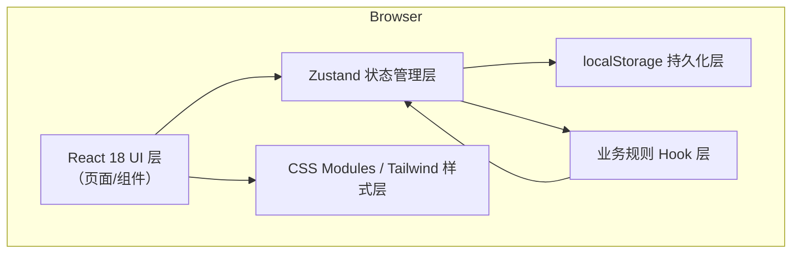
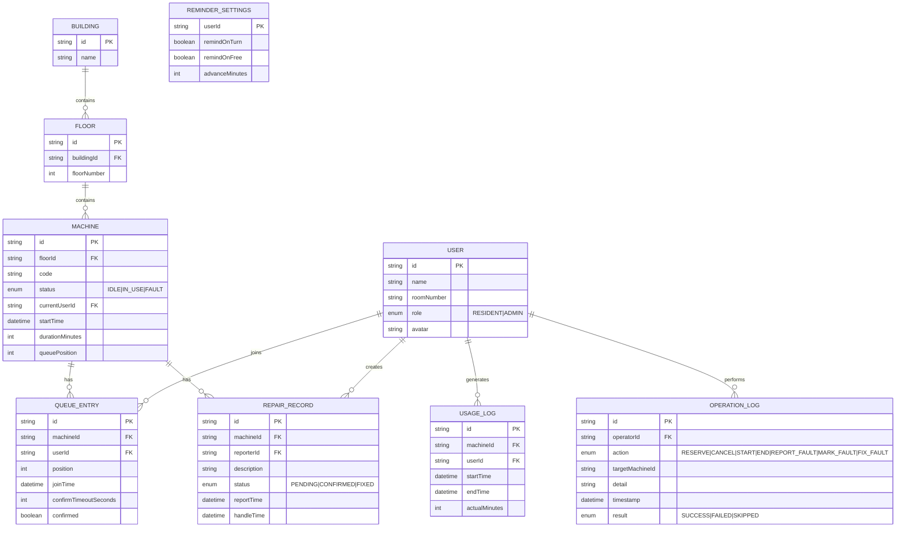

## 1. 架构设计



纯前端单页应用，无后端服务。所有数据通过 Zustand store 管理，中间件持久化到浏览器 localStorage。业务规则封装为自定义 hooks，组件负责 UI 渲染和交互。

## 2. 技术描述

- **前端框架**：React@18 + TypeScript@5 + Vite@5
- **状态管理**：zustand@4 + persist 中间件（localStorage）
- **路由**：react-router-dom@6（单页 Tab 切换，可选 HashRouter）
- **样式**：tailwindcss@3 + PostCSS + CSS 变量
- **图标**：lucide-react
- **数据模拟**：内置 mock 数据（楼栋、楼层、机器、用户）
- **测试**：Vitest 单元测试 + smoke 脚本（Node.js 模拟 localStorage 场景）
- **容器化**：Dockerfile + nginx:alpine 托管静态资源

## 3. 路由定义

| 路由 | 用途 |
|-------|---------|
| /dashboard | 主看板页（默认首页） |
| /admin | 管理员视图（今日概览、日志、报修） |
| /reminders | 提醒设置页面（也可模态打开） |

## 4. 数据模型

### 4.1 数据模型定义（ER 图）



### 4.2 Zustand Store 结构

```typescript
// Store 切片划分：
// - machines: 机器列表 + 当前使用状态 + 倒计时
// - queue: 预约队列映射 { machineId -> QueueEntry[] }
// - users: 用户列表 + 当前选中用户 + 角色
// - repairs: 报修记录
// - logs: 操作日志
// - reminders: 用户提醒设置
// - ui: UI 状态（筛选、抽屉、模态）
```

### 4.3 localStorage 键名

- `laundry_machines_v1`：机器状态
- `laundry_queue_v1`：预约队列
- `laundry_users_v1`：用户列表和当前选择
- `laundry_repairs_v1`：报修记录
- `laundry_logs_v1`：操作日志
- `laundry_reminders_v1`：提醒设置

## 5. 核心业务规则实现

| 规则 | 实现位置 | 触发条件 | 校验逻辑 |
|------|----------|----------|----------|
| 故障机器不能预约 | `useMachineRules.ts` → `canReserve()` | 点击预约按钮 | machine.status === 'FAULT' 返回 false |
| 同一住户同时只能预约一台 | `useMachineRules.ts` → `hasActiveReservation()` | 点击预约按钮 | 遍历所有队列查找 userId，存在则阻止 |
| 占用中机器不能直接开始 | `useMachineRules.ts` → `canStartDirectly()` | 点击开始使用 | status !== 'IDLE' 返回 false，需走队列 |
| 排队第一人超时顺延 | `useQueueTimeout.ts` 定时器 | 每秒检查 | 检查 QUEUE_ENTRY.joinTime + timeout < now 且未 confirm，调用 `shiftQueue()` |
| 管理员标记故障清空操作 | reducer | 管理员操作 | 设置 status=FAULT，清空 startTime/currentUserId，队列保留但所有按钮 disabled |
| 取消预约释放位置 | `cancelReservation()` | 取消按钮 | splice 队列重排 position，写入操作日志 |

## 6. 目录结构

```
src/
├── components/          # 可复用组件
│   ├── layout/         # Header, Sidebar, Container
│   ├── machine/        # MachineCard, MachineGrid, MachineDetailDrawer, StatusBadge
│   ├── queue/          # QueueTimeline, QueueEntryItem, CountdownTimer
│   ├── admin/          # StatsCard, UsageChart, LogTable, RepairList
│   ├── common/         # Button, Modal, Drawer, Toast, Select, Toggle
│   └── forms/          # RepairForm, ReminderForm
├── pages/
│   ├── Dashboard.tsx
│   ├── AdminView.tsx
│   └── ReminderSettings.tsx
├── store/              # Zustand stores
│   ├── index.ts        # 组合所有 slice
│   ├── machines.ts
│   ├── queue.ts
│   ├── users.ts
│   ├── repairs.ts
│   ├── logs.ts
│   ├── reminders.ts
│   └── ui.ts
├── hooks/              # 自定义 hooks
│   ├── useMachineRules.ts
│   ├── useQueueTimeout.ts
│   ├── useCountdown.ts
│   └── useLocalStorage.ts
├── types/              # TypeScript 类型定义
│   └── index.ts
├── utils/              # 工具函数
│   ├── time.ts         # 时间格式化、差值计算
│   ├── mockData.ts     # 初始 mock 数据生成
│   └── validators.ts   # 业务规则辅助函数
├── App.tsx
├── main.tsx
└── index.css
```

## 7. Docker 部署

使用多阶段构建：
1. Node 18-alpine 阶段：pnpm install → pnpm build
2. Nginx alpine 阶段：copy dist → 配置 nginx.conf（SPA fallback）
3. docker-compose.yml 暴露 8080 → 80

## 8. Smoke 测试方案

三个场景用 Vitest 编写，模拟 localStorage：

| 场景 | 测试步骤 | 断言 |
|------|----------|------|
| 刷新后队列保留 | 1. 设置 localStorage 队列数据 2. 初始化 store 3. 读取队列 | 队列长度和顺序与写入前一致 |
| 故障机器预约失败 | 1. 标记机器为 FAULT 2. 调用预约 3. 检查结果和日志 | 返回失败，日志 result=FAILED，队列无新条目 |
| 重复预约被阻止 | 1. 用户 A 预约机器 X 2. 尝试预约机器 Y 3. 检查结果 | 第二次预约返回失败，日志记录原因，只有第一条队列存在 |
